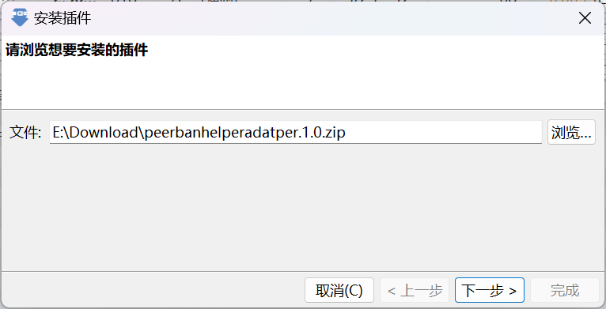

# BiglyBT/Azureus(Vuze)

:::tip

PeerBanHelper 与 BiglyBT 完全兼容，支持最佳。

:::

PeerBanHelper 将借助 BiglyBT 的插件系统连接到 BiglyBT。

请注意你的 BiglyBT 运行的 Java 版本必须是 Java 11+ 版本。如果是 Java 8 或者更低版本，则无法使用。

## 确认 BiglyBT 的 Java 版本

1. 点击 BiglyBT/Vuze/Azureus 的 “帮助” 菜单，并点击 “关于 BiglyBT/Vuze/Azureus”
2. 查看右侧的 “系统信息” 窗口，查看 `Java ` 后面的版本号，如果是 `8` 或者 `1.8` 则不受支持。你需要升级 Java 版本。

## 升级 Java 版本（按需）

如果很不幸，你是 Java 8 版本的受害者，则需要升级 Java 版本。

升级的方式很简单，首先从 [Azul Zulu](https://www.azul.com/downloads/?version=java-21-lts&os=windows&architecture=x86-64-bit&package=jdk#zulu) 下载 Java 21  的 JDK。通过这个链接打开时，页面会自动为您筛选适合的 JDK，直接下载安装即可。  

## 安装 PBH-BiglyBT/PBH-Azureus 适配器

下载 BiglyBT 适配器：[PBH-BTN/PBH-Adapter-BiglyBT](https://github.com/PBH-BTN/PBH-Adapter-BiglyBT/releases)
下载 Azureus/Vuze 适配器：[PBH-BTN/PBH-Adapter-Azureus](https://github.com/PBH-BTN/PBH-Adapter-Azureus/releases)

接下来的过程大同小异。

选择 “工具 -> 插件 -> 从文件安装……”

选中刚刚下载的压缩包下一步安装。

如果 BiglyBT 询问您为谁安装，请根据自己的需要选择。如无特殊要求，请选择默认的选项。

弹出插件安装对话框后，请点击 “安装” 按钮。

如果弹出安全警告，请您允许继续安装。

直到提示安装成功，此时 PeerBanHelper BiglyBT Adapter 适配器的安装过程就完成了。请根据下面的教程继续配置。

## 配置 PBH-BiglyBT/PBH-Azureus 适配器

为了安全起见，PBH-Adapter-BiglyBT 将会生成一个随机 Token，你需要获取这个随机 Token 才能在 PeerBanHelper 中连接到您的 BiglyBT 下载器。
点击 “工具->选项” 打开选项窗口。点击 “插件” 左侧的倒三角标志，展开插件配置菜单。

找到 “PeerBanHelper 适配器 - 配置界面”，点击进入配置页面。

配置 API 端口号，并记下 Token。**随后点击保存按钮，请务必点击一次，否则重启后 Token 将重新生成。**

## 连接到 PeerBanHelper

在添加下载器的页面，选择 BiglyBT（Azureus/Vuze 用户也请选择这个）

选择 “BiglyBT”，并填写刚刚设置的端口号和记下的 Token：

确定保存即添加完成。
