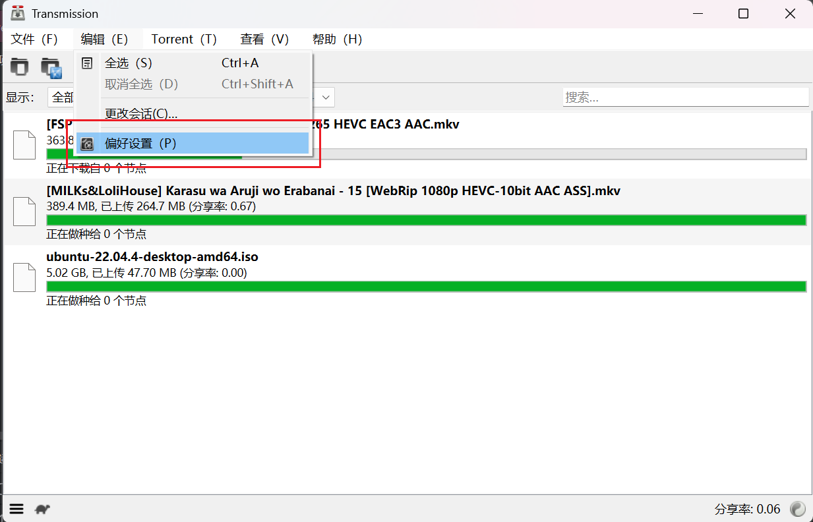

# Transmission

Transmission 已被 PeerBanHepler 标记为*废弃*，你不应该继续使用它。使用 Transmission **你将不会得到任何支持**，如果你因为 Transmission 的问题到 Issues 打开 Issue/QQ群询问，则会被删除或禁言。  
Transmission 适配器将不会得到任何功能增强或者错误修复。  

对于在 Linux 和 Docker 上使用 Transmission 的用户，你大概已经配置好了 WebUI，可以跳过前面的步骤。   

## 启用 WebUI

1. 点击 “编辑” 菜单，进入 “偏好设置”，并转到 “远程” 选项卡
2. 勾选 “允许远程访问”
3. 勾选 “使用身份验证”，并配置一个用户名和密码
4. 点击关闭

## 配置 PeerBanHelper 屏蔽列表提供端点

1. 在 PeerBanHelper 中打开 “程序” 菜单，并选择 “打开数据文件存储位置...”。
2. 进入 `config` 目录
3. 打开并编辑 `config.yml` 配置文件，建议使用 [VSCode](https://code.visualstudio.com/) 打开，避免出现语法错误或者编码问题
4. 找到 `server.prefix` 字段，更改其 IP 地址和端口。注意：此地址必须可以**从** Transmission 访问到
5. 保存，重启 PeerBanHelper

## 添加 Transmission 到 PeerBanHepler 中

1. 打开添加下载器窗口
2. 顶部下载器类型，选择 “Transmission”
3. 名称可随意填写，唯一的要求是不要带有英文句号（`.`）
4. 地址部分，填写 `http://localhost:端口号`，其中端口是你上面设置的端口号。填写地址时，特别注意不要以 `/` 结尾
5. 用户名为上面设置 “验证” 时，填写的用户名
6. 密码为上面设置 “验证” 时，填写的密码
7. 点击确定，提示成功即添加成功

## 验证可用

Transmission 的 IP 黑名单是外置的，但 PBH 需要为 TR 动态生成 IP 黑名单。因此您必须确保 TR 可以访问 PBH 的提供端点。  
在添加下载器后，请观察一段时间 PBH 的运行日志，如果没有出现 Transmission 黑名单设置错误的提示，则成功配置。

