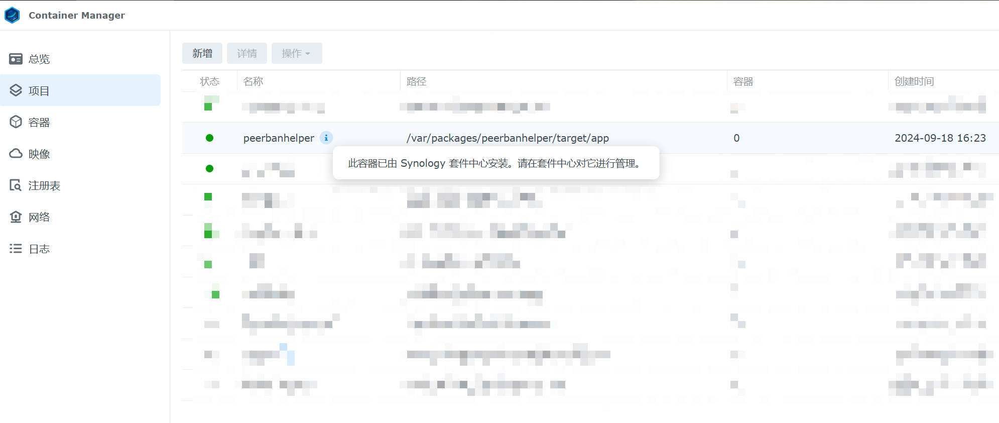

# Synology DSM 群晖（套件）

## 添加矿神 SPK7 源

PeerBanHelper 与 [imnks.com](https://imnks.com/) 合作，将 PeerBanHelper 以容器套件的方式带到群晖的套件中心，并提供安装和更新服务。  

首先，请跟随[矿神SPK源官方教程](https://imnks.com/1780.html)，为您的 DSM 设备启用矿神社区源。

## 在套件中心安装 PBH

在添加矿神社区源后，您可以前往社群选项卡并在搜索框中搜索 “PeerBanHelper”。

找到 PeerBanHelper 后，点击“安装套件”安装。

跟随安装向导完成后续配置流程。

## 修改 PeerBanHelper 配置

安装完成后，PeerBanHelper 将会自动创建一个名为 `peerbanhelper` 的共享文件夹，你可以在里面管理所有 PBH 的相关文件。您还可以为其切换存储空间，但对共享文件夹本身执行任何除切换存储空间以外的操作可能导致工作异常。

如需进入 WebUI 界面，可在主菜单中找到 PBH 的程序图标，点击即可打开 WebUI。

如需管理容器，可在 Container Manager 中找到 PBH 的项目。

## 配置下载器

尽管安装的是套件，但本质上（目前）仍然是个 Docker 容器。因此也得按照 Docker 的步骤来配置网络。访问也在同一个 NAS 上的下载器时，需要使用网关地址而非 `127.0.0.1` 或者 `localhost`。网关地址可在 Container Manager -> 网络 -> peerbanhelper_default 中找到。

