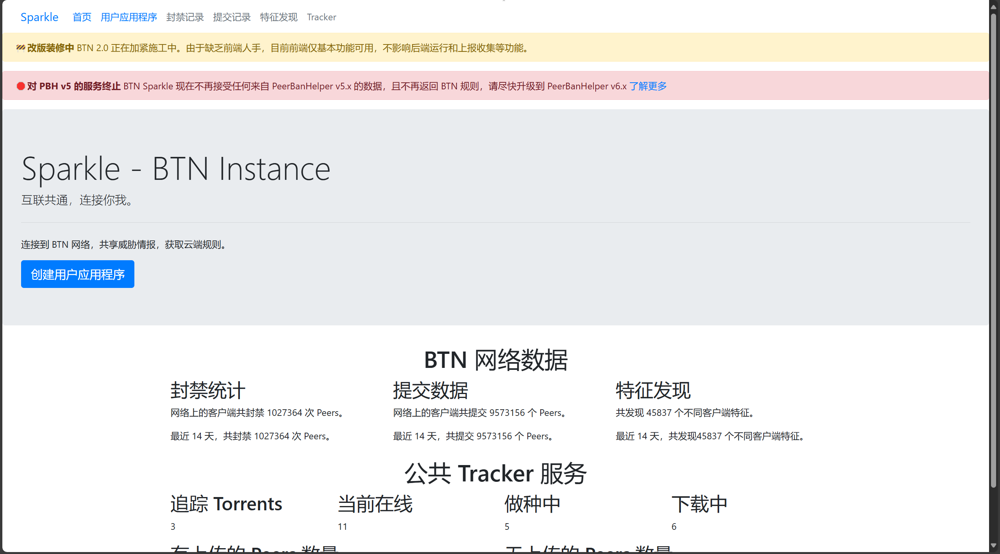
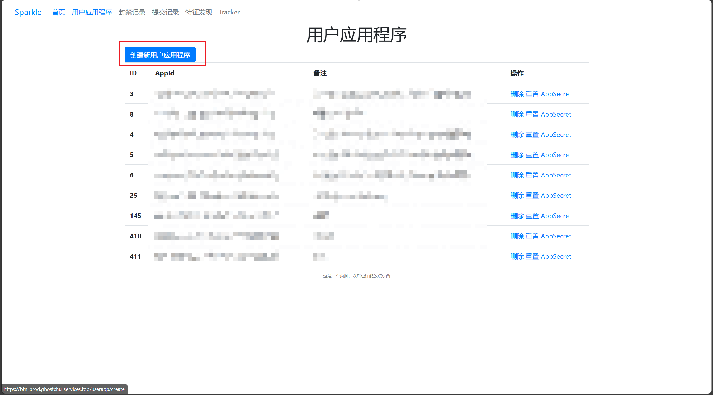
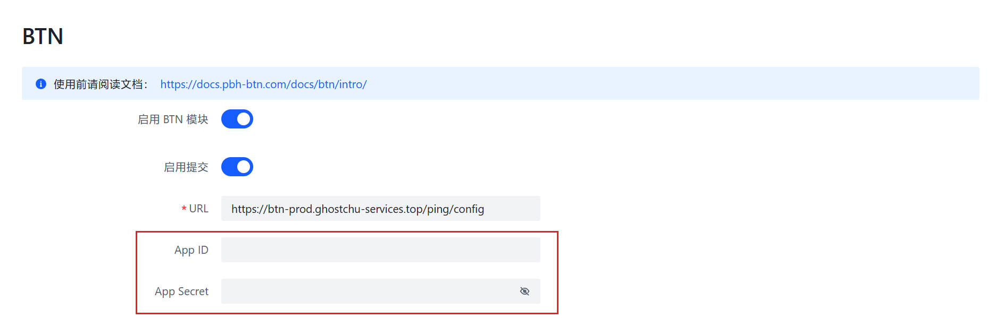

# Connect to BTN

 To participate in the BTN program, you just need to connect the BTN client to the BTN server. This article uses PeerBanHelper as the BTN client and Sparkle as the BTN server for demonstration.

## Sparkle

Sparkle is the official BTN server of PBH-BTN.

### Register an account, create UserApp

Open the browser [https://btn-prod.ghostchu-services.top](https://btn-prod.ghostchu-services.top) and log in with GitHub authorization, an account will be automatically created.

Click on the "User Applications" link in the top menu to go to the management page.

Click "Create New User Application", enter a note, and then click the button to create.

Now note down the `AppID` and `AppSecret` displayed on the page, because once you close this page, the `AppSecret` will no longer be displayed.

## Join the BTN network on PBH

Go to Settings -> Basic Settings option.

Scroll down to find BTN settings, open "Enable BTN Module", and fill in the AppID and App Secret obtained above:

Scroll to the bottom, click the "Save" button, and then restart PeerBanHelper to make it effective.

