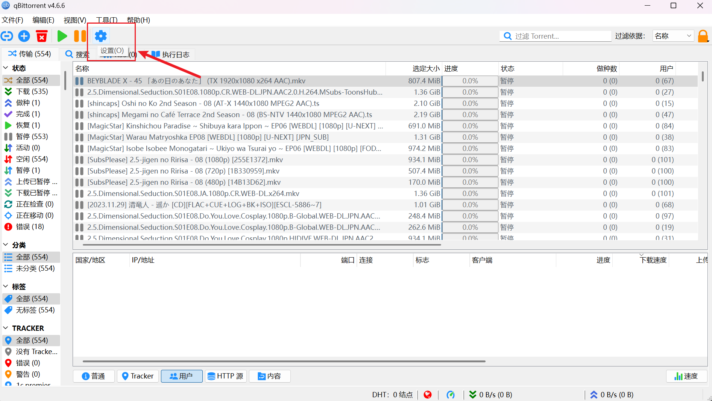
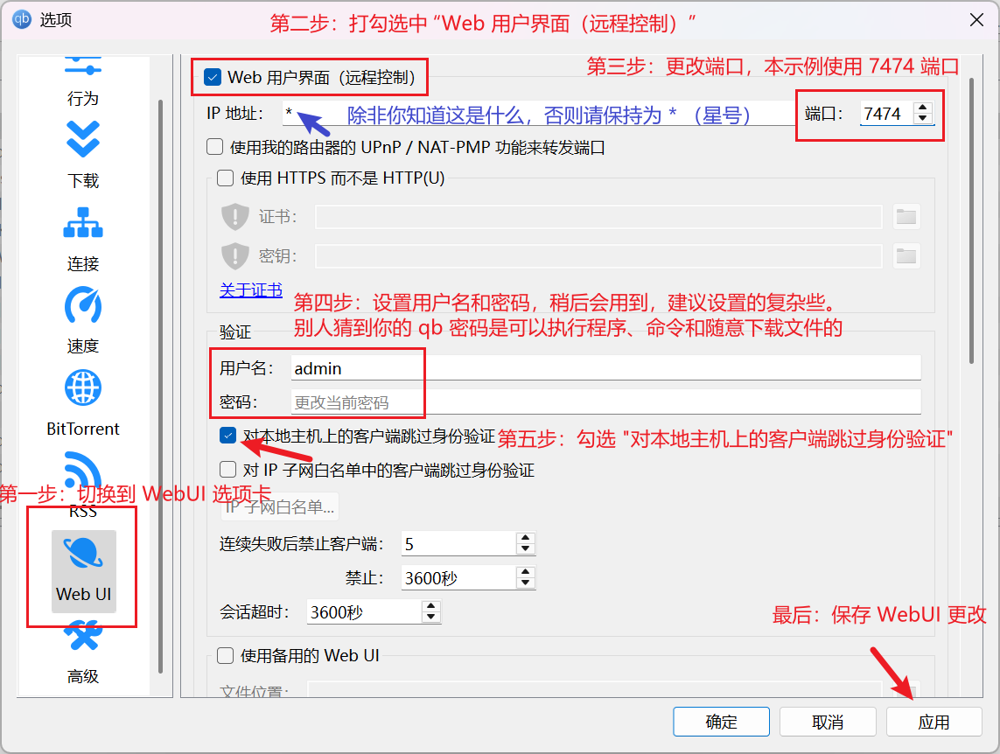
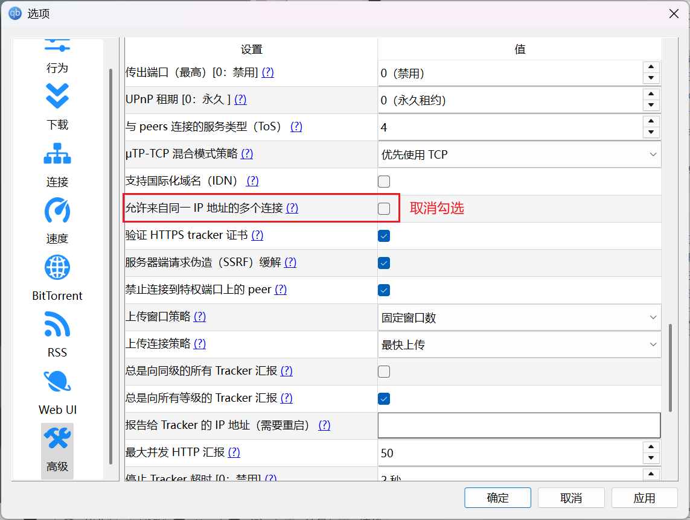
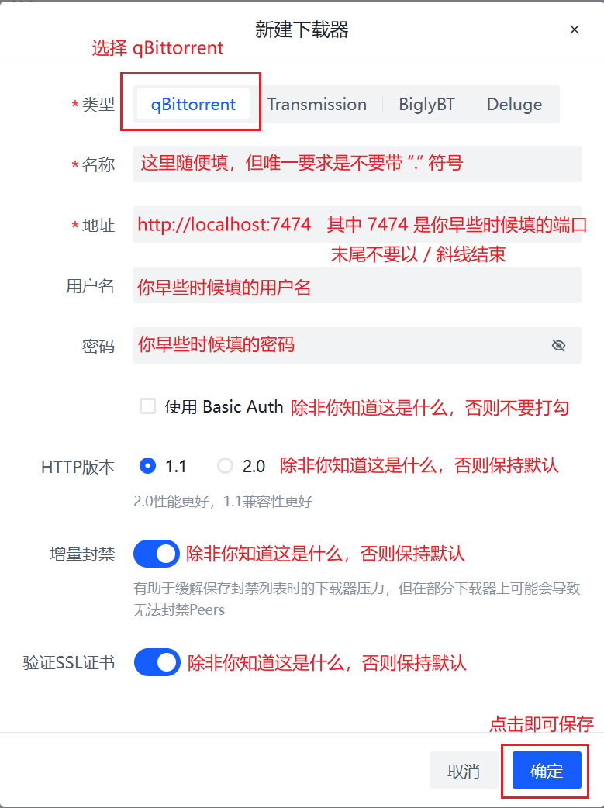

# qBittorrent

PeerBanHelper 使用 qBittorrent WebAPI 与 qBittorrent 交互。本章将介绍如何为 qBittorrent 启用 WebUI 并将 PeerBanHelper 与 qBittorrent 连接。  
对于在 Linux 和 Docker 上使用 qBittorrent 的用户，你大概已经配置好了 WebUI，可以跳过前面的步骤。

## 启用 WebUI

点击主页面上的齿轮图标，打开设置菜单。

然后按照下列步骤操作：

1. 在左侧菜单中，切换到 "WebUI" 选项卡
2. 勾选 “Web 用户界面（远程控制）”
3. 配置一个端口号，本示例使用 `7474`，注意：IP地址实际上为 “监听网卡地址”，不知道这是什么意思的话，并保持默认为 `*`
4. 在 “验证” 中，设置一个用户名和密码，最好是高强度密码。如果有人猜到了你的密码，则可以进入 qB 下载文件和执行命令/程序。
5. 最后点击右下角的 “应用” 按钮，保存设置

## 配置高级设置

除了启用 WebUI 以外，还有一些设置需要进行调整，确保 PeerBanHelper 能够正常工作：

1. 在左侧菜单中，切换到 “高级” 选项卡
2. 找到 “解析用户主机名”，如果它被勾选了，请**取消勾选**
3. 继续向下滚动页面，在 “libttorrent 相关” 部分，找到 “允许来自同一 IP 地址的多个连接”，如果它被勾选了，请“取消勾选”

## 在 PeerBanHelper 中添加 qBittorrent 下载器

按照以下步骤添加下载器：

1. 打开添加下载器窗口
2. 顶部下载器类型，选择 “qBittorrent”
3. 名称可随意填写，唯一的要求是不要带有英文句号（`.`）
4. 地址部分，填写 `http://localhost:7474`，其中 `7474` 是你上面设置的端口号。填写地址时，特别注意不要以 `/` 结尾
5. 用户名为上面设置 “验证” 时，填写的用户名
6. 密码为上面设置 “验证” 时，填写的密码
7. 点击确定，提示成功即添加成功

