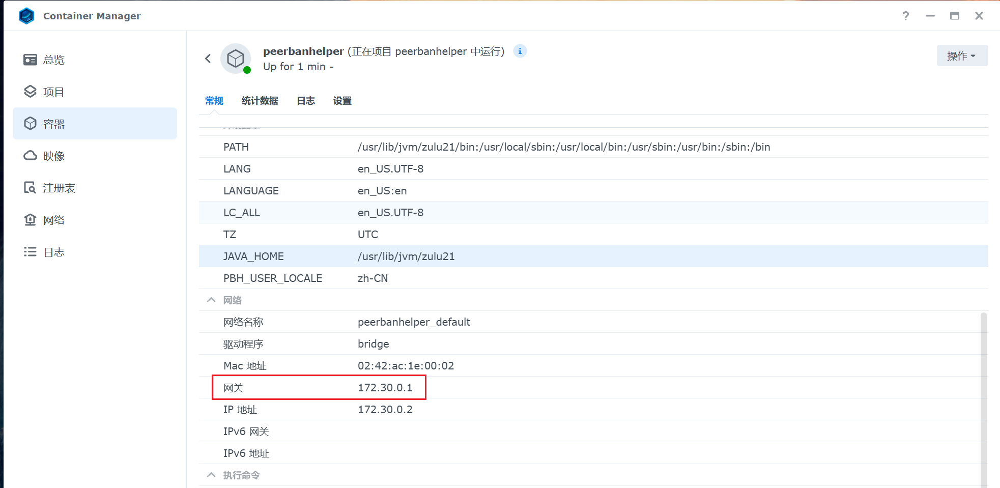
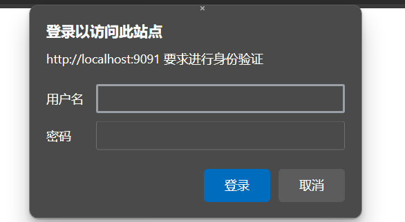

# FAQ

## After upgrading, WebUI is white/black screen or stuck on infinite data loading

Clear your browser cache and refresh.

## Startup error Failed to bind to port / Port already in use. Make sure no other process is using port XXXX and try again.

Two PeerBanHelpers are launched at the same time (especially common when incorrectly selected "Install as system service" during installation); or the port is occupied causing port conflict (such as Uplay/Ubisoft Connect etc.).

### If it is installed as a system service

If you don't know what this is for, please run the uninstaller to remove the system service from the system, and reinstall after restarting.

### If Uplay/Ubisoft Connect is running; other programs occupy the WebUI port

Please exit first, or [change the WebUI port](./network/http-server.md#change-webui-port)

## Can't connect to the downloader via 127.0.0.1 or localhost

This problem is mostly caused by deploying with Docker containers. Using `127.0.0.1` or `localhost` in the container points to the inside of the container, of course it can't connect.

Synology users: Container Manager -> Container -> Find the PBH container -> Scroll down, connect using the displayed gateway address.



Other Docker users: execute `sudo docker network inspect bridge` command:

```json
"IPAM": {
            "Driver": "default",
            "Options": null,
            "Config": [
                {
                    "Subnet": "172.17.0.0/16",
                    "Gateway": "172.17.0.1"
                }
            ]
        }
```

Connect using the above Gateway address.

## Unable to download IPDB/GeoIP library / Proxy invalid

See: [Configure Proxy Server](./network/proxy-server.md)

## Where is the WebUI management Token?

See: [Change WebUI Token](./network/http-server.md#change-webui-token)

## What are the disadvantages of Transmission/Why is it abandoned?

See: [Abandoning support for Transmission downloader #382](https://github.com/PBH-BTN/PeerBanHelper/issues/382)

## Why does the anti-leech progress checker show progress over 100% (e.g., 102%), is there an error? How can it exceed 100%?

No, the progress checker will accumulate the download progress of this IP address on a specific torrent. If the other party appears to regress, disconnect and reconnect with a different port, change PeerID, change Client name and re-download, the downloader will consider this a new client and start calculating download data from scratch (leechers also use this method to bypass leech checks). But for PBH, as long as the other party's IP address remains unchanged (or within a specific range), and the torrent being downloaded has not changed, the download progress will continue to accumulate incrementally, preventing the other party from deceiving the anti-leech check. For example, if a file size is 1000MB, the other party downloading 102% means that the other party has actually downloaded 1020MB of data on this 1000MB size torrent.

## PBH prompts my downloader "multiple consecutive login failures" and pauses, what should I do?

You can click the edit button of the downloader, and then click OK to save. PBH will lift the pause and try to log in again, at which point the reason for the login failure will be displayed. Please troubleshoot according to the reason (for example: network connection problems, whether WebUI is enabled, whether the username and password are correct, etc.). After troubleshooting, save it again to lift the pause.

## What is incremental banning?

Non-incremental banning: each time a new IP needs to be banned, the entire IP blacklist is directly replaced. This can easily cause the downloader to freeze on qBittorrent.
Incremental banning: each time a new IP needs to be banned, the banPeer API is used to incrementally add banned IPs; when unbanning, the entire IP blacklist is still directly replaced.

## What is SSL certificate verification?

If the entered address is an HTTPS address and this switch is enabled, the validity of the SSL certificate will be verified. If the certificate is invalid, an error will be reported to ensure security. If it is turned off, all SSL certificates will be trusted.

## What is Basic Auth?

Some tutorials will let you add an extra layer of username and password for security through reverse proxy or Nginx. The feature is that the browser will pop up for verification when accessing:



This is Basic Auth.

# In statistical data, why is the ban count higher than the access count?

When a Peer connects and generates traffic, it is counted as one access. If the Peer is banned before generating traffic (for example, during the handshake stage), it is only counted as one ban.

## How to permanently ban IP

Consider to use [IP Blacklist](./module/ip-address-blocker.md).

## Why can't I edit custom scripts? What is "read-only mode"?

For security reasons, the script editing function will reject requests from the Internet, which can protect your device in the event of a Token leak.

If for some reason you have to edit scripts on the Internet and understand that **hackers can execute any code on your device after a Token leak**, you can add the following `flag` at startup:
```
java -Dpbh.please-disable-safe-network-environment-check-i-know-this-is-very-dangerous-and-i-may-lose-my-data-and-hacker-may-attack-me-via-this-endpoint-and-steal-my-data-or-destroy-my-computer-i-am-fully-responsible-for-this-action-and-i-will-not-blame-the-developer-for-any-loss ...
```
