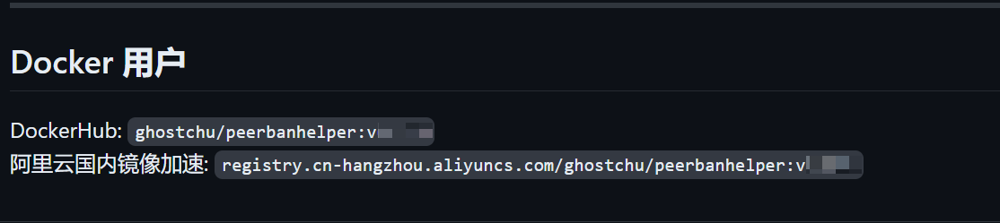

# Docker

Docker is the recommended deployment method for PeerBanHelper on Linux. Using the sample configuration file and CLI commands provided by PBH, PBH will be able to follow the system to start automatically and run in the background (unless stopped manually).

## Get the version tags

First visit the [PBH latest version release page](https://github.com/PBH-BTN/PeerBanHelper/releases/latest), find the “Docker Users” section as shown and copy the image tag for backup.



**DO NOT** use the latest tag, as it may be cached.

## Using Docker Compose

Create a `docker-compose.yml` file in the directory where you want to store the PBH data, and paste the following content:

```yaml
version: "3.9"
services:
  peerbanhelper:
    image: "<tags>"
    restart: unless-stopped
    container_name: "peerbanhelper"
    volumes:
      - ./:/app/data
    ports:
      - "9898:9898"
    environment:
      - PUID=0
      - PGID=0
      - TZ=UTC
```

Replace `<tags>` with the image tag you just copied.

Then run the following command:

```shell
docker-compose up -d
```
The webui will be opened at `9898`.

## Using docker cli

Create a directory as the data storage location for PBH, and switch the working directory to this location.
```shell
sudo docker run -d --name peerbanhelper --stop-timeout -p 9898:9898 -v ${PWD}/:/app/data/ <tags>
```
The webui will be opened at `9898`.
